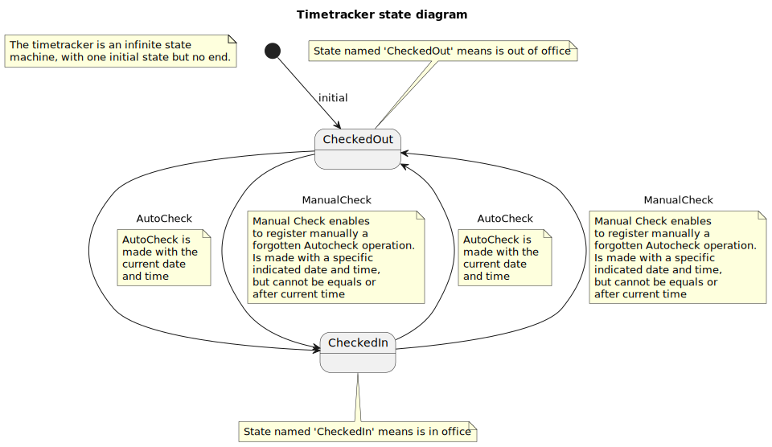
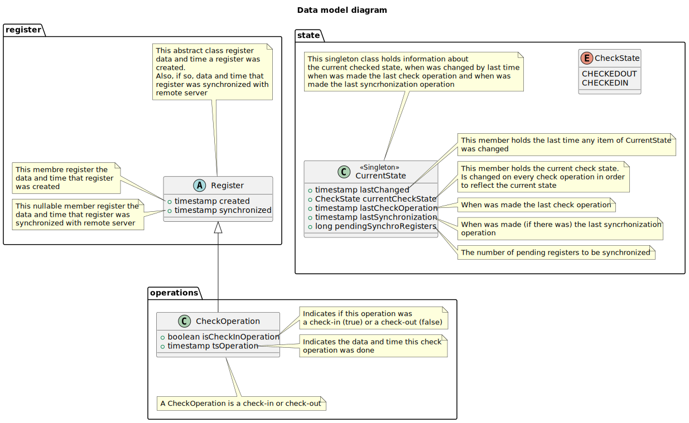

# Timetracker

## Introduction

This software is an application to maintain a register of check-in and check-out of a office.
So, a time-tracker report can be done in any moment to show the time spent in office.

The idea behind this software is to let employees a tool to ledge the hours spent in office, in order to known if they are under the amount of labor hours, in the same amount of labor hours or above the amount of labor hours.

This simple check-in check-out tool trace the total amount of labor hours made and which of this hours is current or extra.

## State diagram

The software is a finite machine state with only two states: CheckedIn or CheckedOut:

There are two different events to change from one state to another:

* AutoCheck: changes from one state to the another
* ManualCheck: If any autocheck was lost or forgotten, the user can introduce them manually and then state changes from one to another

## Data model

The data model is the following:

* **Package register**: data model of classes to maintain information above the synchronized state of every register on system
* **Package operations**: Data models to hold information of each check-in or check-out operation
* **Package state**: Data model to hold the current state, last times of check operation, synchronization, pending synchronization registers, etc.

